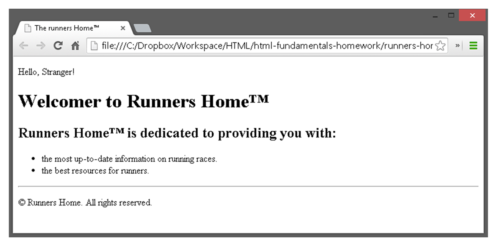
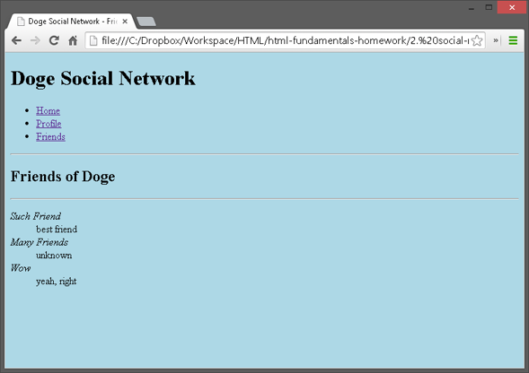
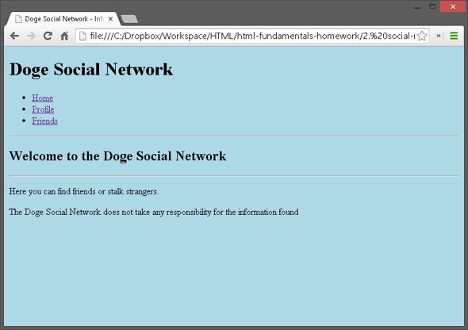

# HTML Fundamentals

## Exercise 1
Write an HTML page like the following:

* Use headings and divs

## Exercise 2
Write an HTML page like the following:

## Exercise 3
Create an user profile Web page `Profile.html`, friends page named `Friends.html` and info page named `Info.html`. Link them to one another using `<a>` tag.

