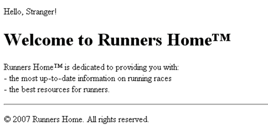
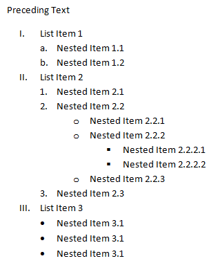
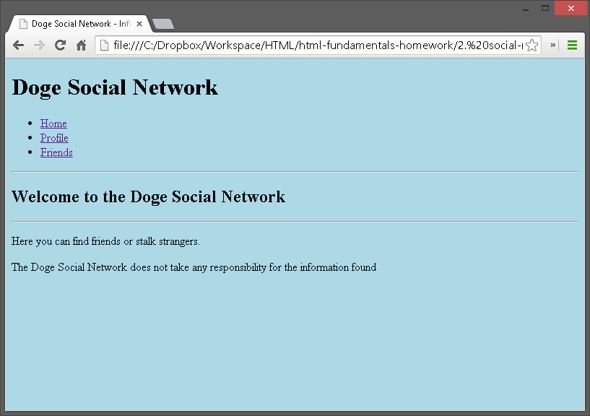

HTML Fundamentals
=================

### Problem 1. Runners Home page
*	Write an HTML page like the following:

_Note: use headings, divs, paragraphs and ul_

### Problem 2. Nested Lists
*	Write an HTML page like the following:

### Problem 3. Social site
*	Create an user profile Web page `profile.html`, friends page named `friends.html` and info page named `home.html`.
*	Link them to one another using `<a>` tag

