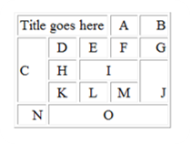
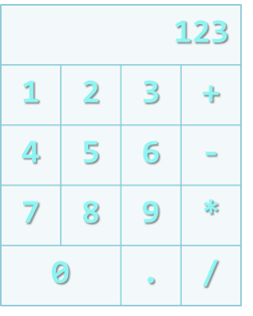

HTML Tables
===========

### Problem 1. HTML Tables
*	Create Web Pages like the following using tables:

### Problem 2. Calculator
*	Create a Calculator-like table. You should use a HTML 5 form for the Calculator.
	*	Buttons for all the numbers and operators (+, -, etc.)
	*	Textbox for the result
	

_Note: Do not make the same styles as the example_

_Note: Do not implement functionalities_